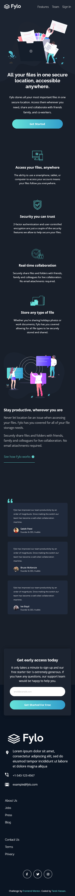

# Frontend Mentor - Fylo dark theme landing page solution

## Preview of challenge

This is a solution to the [Fylo dark theme landing page challenge on Frontend Mentor](https://www.frontendmentor.io/challenges/fylo-dark-theme-landing-page-5ca5f2d21e82137ec91a50fd). Frontend Mentor challenges help you improve your coding skills by building realistic projects. 

## Table of contents

- [Overview](#overview)
  - [The challenge](#the-challenge)
  - [Screenshot](#screenshot)
  - [Links](#links)
- [My process](#my-process)
  - [Built with](#built-with)
- [Author](#author)

## Overview

### The challenge

Users should be able to:

- View the optimal layout for the site depending on their device's screen size
- See hover states for all interactive elements on the page

### Screenshot of Sollution

### Links

- Solution URL: [Add solution URL here](https://github.com/Dodger23/Frontend-Mentor-Fylo-landing-page)
- Live Site URL: [Add live site URL here](https://frontend-mentor-fylo-landing-page-seven.vercel.app/)

## My process

### Built with

- Semantic HTML5 markup
- CSS custom properties
- Flexbox
- CSS Grid
- Mobile-first workflow

## Author

- Frontend Mentor - [@Dodger23](https://www.frontendmentor.io/profile/Dodger23)
- LinkedIn - [@Tarek-a-Hassan](https://www.linkedin.com/in/tarek-a-hassan/)
